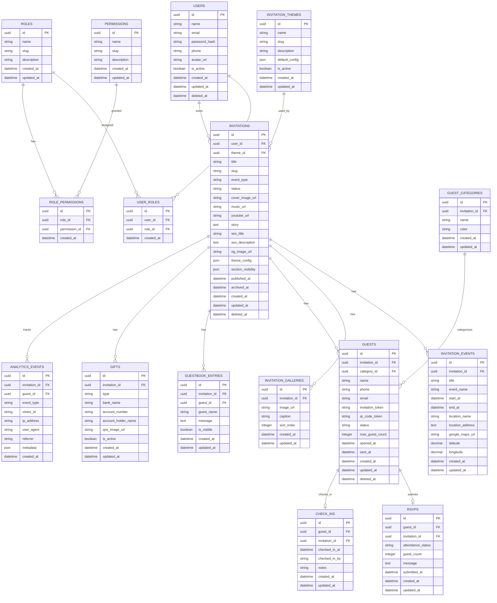

# UndangAbi V2 - Entity Relationship Diagram

## Overview

Dokumen ini menjelaskan desain database UndangAbi V2.

Catatan:

* Struktur `users` dan `rbac` mengikuti pola dari project `umkm-pos`.
* Domain UndangAbi dibuat khusus untuk kebutuhan digital invitation, guest management, RSVP, QR check-in, dan analytics.

---

# ERD Diagram



---

# Table Details

## users

Mengikuti pola project `umkm-pos`.

Menyimpan data user platform.

Role:

* Admin
* Customer

---

## roles

Menyimpan daftar role.

Default role:

```txt
admin
customer
```

---

## permissions

Menyimpan daftar permission.

Contoh permission:

```txt
manage_users
manage_templates
manage_all_invitations
view_global_analytics

manage_own_invitations
manage_own_guests
manage_own_rsvp
view_own_analytics
```

---

## user_roles

Pivot table antara user dan role.

Satu user dapat memiliki lebih dari satu role.

---

## role_permissions

Pivot table antara role dan permission.

Satu role dapat memiliki banyak permission.

---

# UndangAbi Domain Tables

## invitations

Entity utama undangan.

Satu user dapat memiliki banyak invitation.

Status:

```txt
draft
published
archived
```

Event type:

```txt
wedding
khitanan
birthday
graduation
seminar
gathering
custom
```

---

## invitation_themes

Menyimpan tema bawaan.

Default themes:

```txt
elegant
modern
nature
```

Theme config disimpan dalam bentuk JSON.

---

## invitation_events

Menyimpan detail acara.

Satu invitation dapat memiliki lebih dari satu event.

Contoh:

* Akad
* Resepsi
* Ngunduh Mantu
* Main Event

---

## invitation_galleries

Menyimpan foto gallery undangan.

---

## guest_categories

Kategori tamu per invitation.

Default:

```txt
Keluarga
Teman
Kantor
VIP
```

---

## guests

Menyimpan data tamu.

Status:

```txt
not_sent
sent
opened
rsvp_submitted
checked_in
```

Field penting:

```txt
invitation_token
qr_code_token
```

Digunakan untuk personalized invitation dan QR check-in.

---

## rsvps

Menyimpan konfirmasi kehadiran.

Attendance status:

```txt
attending
not_attending
```

---

## guestbook_entries

Menyimpan ucapan dan doa dari tamu.

---

## gifts

Menyimpan informasi amplop digital.

Type:

```txt
bank_transfer
qris
```

---

## check_ins

Menyimpan data kehadiran tamu saat QR di-scan.

---

## analytics_events

Menyimpan event tracking.

Event type:

```txt
invitation_viewed
rsvp_submitted
guestbook_submitted
gift_clicked
calendar_clicked
qr_checked_in
```

---

# Important Rules

## Multi Invitation

```txt
1 User = Many Invitations
```

---

## Ownership

Customer hanya boleh mengakses invitation miliknya sendiri.

Admin boleh mengakses semua invitation.

---

## Guest Uniqueness

Dalam satu invitation, `invitation_token` harus unik.

Dalam satu invitation, `qr_code_token` harus unik.

---

## Slug Uniqueness

Slug invitation harus unik secara global.

Contoh:

```txt
undangabi.com/ganjar-fitri
```

---

## Soft Delete

Gunakan soft delete untuk:

* users
* invitations
* guests

---

## Analytics

Analytics tidak perlu di-soft-delete.

Analytics bersifat append-only.

---

# Index Recommendation

Tambahkan index pada:

```txt
users.email
invitations.slug
invitations.user_id
guests.invitation_id
guests.invitation_token
guests.qr_code_token
rsvps.guest_id
check_ins.guest_id
analytics_events.invitation_id
analytics_events.event_type
analytics_events.created_at
```

---

# Future Tables

Belum masuk MVP:

```txt
subscriptions
plans
payments
teams
team_members
custom_domains
whatsapp_reminders
ai_generations
```
